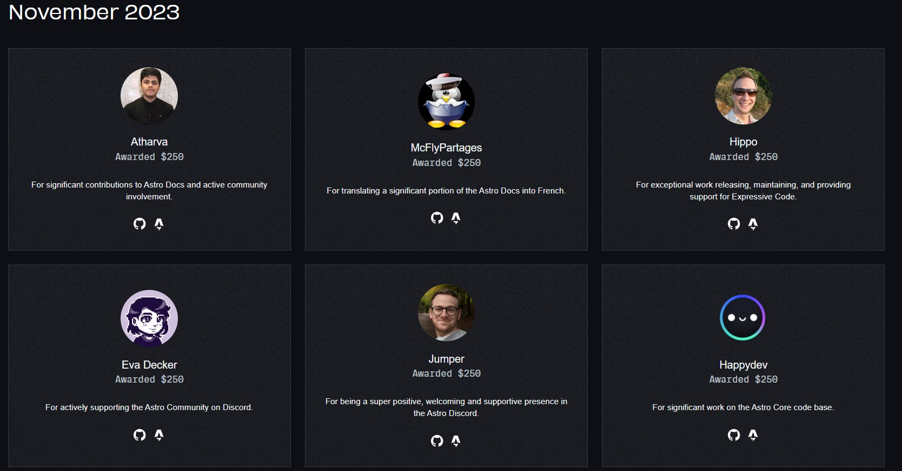

## OMG OMG OMG 🤩

Last week I won a Community Award in Astro. Pretty cool achievement if asked in [Astro Lounge](https://discord.gg/astrodotbuild). Reason's pretty clear: *for significant contributions to Astro Docs and active community involvement*

Don't bother zooming in, find all the Community Award Winners [here ↗](https://community.astro.build/)

## How did it happen 🤔

It starts off with my obsession with Discord. I got to know about Astro's Discord Server link right on their [official website](https://astro.build/). I was watching tutorials on YouTube about Astro and found their selling point great. Months passed since I joined and in September I found their *#i18n-crew-hi* thread talking about how Astro Docs is ready to be translated in Hindi Language.

### Chance to Contribute 🟩

It could not be any simpler, translate their page in a supported language (in my case that would be *Hindi*) and submit a PR. I found this path benefitting both parties. I get to learn about Astro during the translation process and Astro Docs remain translated and updated at the same time. This is what I have been doing since then.

### Support Squad 👷‍♂️

Support Squad is an opt-in role in Astro Lounge that focuses on helping members with their Astro Journey. Even if someone doesn't opt in, they can resolve any queries faced by members in the Astro Lounge. I might not be a maestro in Astro but that does not stop me from troubleshooting queries for anyone confused with their Issue.

### Starlight 🌟

[Starlight](https://starlight.astro.build/) is the next-gen Documentation theme with a blazingly fast ⚡ performance and accessible solutions thanks to being built on top of Astro. Needless to say, I contribute here as well, primarily with translations but sometimes I get into Issues and Discussions as well. It's an amazing theme and I have a couple of projects running on Starlight.

### Pheww that was a lot 💬

Combine all of this and we get a Community Award Winner. Is this the only path? **NO**, seriously don't follow this path just for the Award. Instead, get inspired by the work and efforts put up by the community members and find your shtick.

## Closing Words 🤐

I am grateful for Astro and the community nurtured by their team over the past years. I witnessed Astro move from 3.0 to 4.0, wish I had been an alpha user 🙃. If you have a content-driven website to build, [Astro](https://astro.build/) will make it happen for you.
