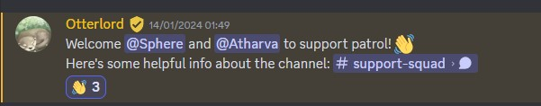

## Exciting News 🎉

Last week I received a DM from [Otterlord](https://otterlord.dev/) telling me that I am invited to join the **@support-patrol** role in [Astro Lounge](https://discord.gg/astrodotbuild). This is a significant achievement for myself including my weekly translation PRs to Astro Docs & Starlight.

## Perks 💪

Do I get to kick people? Do I get to mute people? Do I get to ban people? **NO**. The only perk important for any member to know is *@support-patrol* have a high trust factor. Any advice/suggestion from such folks can be carried out to diagnose their queries be it in Astro or any technology.

## What Now 🤔

*@support-patrol* is a milestone and I want to learn more about Astro. Every week I get to experience something different, something that I haven't faced in a large scale project. Their are repositories that I want to explore & contribute to. Discussions I want to participate, Issues I want to fix. So many things...

## Astro Lounge 🚀

[Astro Lounge](https://discord.gg/astrodotbuild) is the offical Discord server for Astro Community. Want to learn more about Astro? Wanna showcase your site made using Astro? Need support with some terminology you read on Astro Docs? Want to participate in Astro Community Events? All of these and more are actively found in Astro Lounge.
